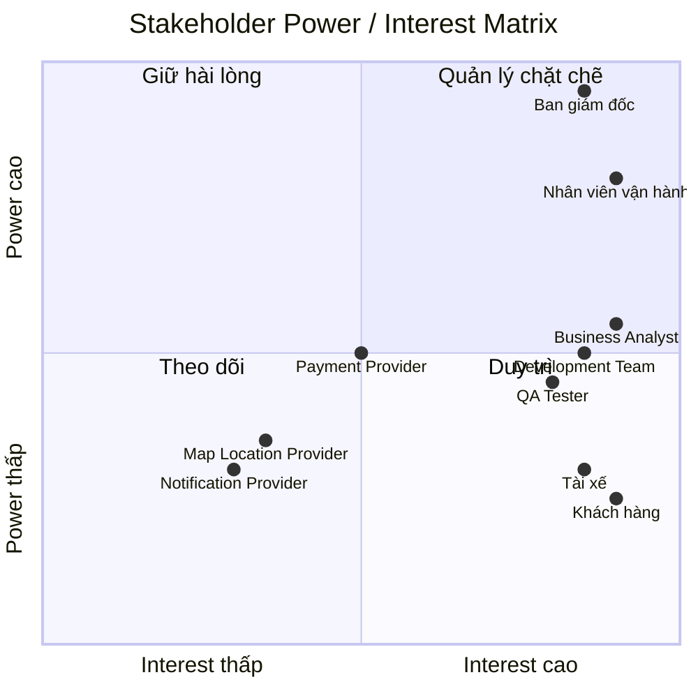

# CAB System – Phân tích nghiệp vụ

## Bước 1: Tìm hiểu nghiệp vụ

### 1. Vấn đề hệ thống

Hệ thống đặt xe hiện tại của Công ty ABC đang tồn tại một số vấn đề chính:

#### 1.1. Phân công tài xế thủ công

- Việc phân công tài xế chủ yếu được thực hiện thủ công.
- Khó tìm được tài xế phù hợp và gần khách hàng.
- Khi tài xế từ chối hoặc không phản hồi, việc tìm tài xế khác còn hạn chế.
- Khó mở rộng khi số lượng khách hàng và tài xế tăng cao.

#### 1.2. Khách hàng khó theo dõi chuyến đi

- Khách hàng khó biết yêu cầu đặt xe đang ở trạng thái nào
- Không dễ dàng biết tài xế nào đã nhận chuyến.
- Khó theo dõi thời gian dự kiến tài xế đến.
- Khó theo dõi trạng thái chuyến đi trong quá trình di chuyển.

#### 1.3. Quản lý thanh toán chưa tập trung

- Thông tin thanh toán chưa được quản lý tập trung.
- Chưa có cơ chế thống nhất để quản lý trạng thái thanh toán.
- Cần hỗ trợ cả thanh toán tiền mặt và thanh toán điện tử.
- Khi thanh toán điện tử thất bại cần có cơ chế xử lý lại.

#### 1.4. Khó khăn trong vận hành

Bộ phận vận hành gặp khó khăn trong việc:

- Quản lý khách hàng.
- Quản lý tài xế.
- Quản lý phương tiện.
- Theo dõi các chuyến đang diễn ra.
- Kiểm tra trạng thái tài xế.
- Xử lý các trường hợp chuyến bị lỗi.
- Tra cứu lịch sử giao dịch.
- Kiểm soát quyền của nhân viên.

#### 1.5. Hệ thống khó mở rộng

Hệ thống hiện tại chưa đáp ứng tốt nhu cầu phát triển lâu dài của doanh nghiệp:

- Khó phục vụ số lượng lớn khách hàng và tài xế.
- Khó mở rộng thêm loại dịch vụ.
- Khó thêm phương thức thanh toán.
- Khó thêm các kênh thông báo mới.
- Khó thay đổi hoặc tích hợp thêm các nhà cung cấp bên ngoài.
- Một lỗi ở thanh toán hoặc thông báo có thể ảnh hưởng đến hoạt động của hệ thống.

#### 1.6. Một số nghiệp vụ chưa được xác định rõ

Doanh nghiệp hiện chưa thống nhất:

- Cách tính cước.
- Tiêu chí ưu tiên tài xế.
- Thời gian tài xế phải phản hồi.
- Chính sách hủy chuyến.
- Cách xử lý khi mất kết nối mạng.
- Thời gian lưu trữ dữ liệu.

Các vấn đề này cần được Business Analyst làm rõ với các bên liên quan trước khi phát triển hệ thống.

---

## 2. Mục tiêu đem lại

Hệ thống CAB System mới được xây dựng nhằm giải quyết các hạn chế của hệ thống hiện tại và tạo ra một nền tảng đặt xe có khả năng phát triển lâu dài.

### 2.1. Đối với khách hàng

Hệ thống giúp khách hàng:

- Đăng ký và đăng nhập tài khoản.
- Quản lý thông tin cá nhân.
- Nhập điểm đón và điểm đến.
- Lựa chọn loại xe.
- Gửi yêu cầu đặt xe.
- Theo dõi quá trình tìm tài xế.
- Biết tài xế đã nhận chuyến.
- Theo dõi thời gian dự kiến tài xế đến.
- Theo dõi trạng thái chuyến đi.
- Xem lịch sử chuyến đi.
- Xem số tiền phải thanh toán.
- Thanh toán bằng tiền mặt hoặc phương thức điện tử.
- Đánh giá tài xế sau khi hoàn thành chuyến.

### 2.2. Đối với tài xế

Hệ thống giúp tài xế:

- Quản lý tài khoản và hồ sơ cá nhân.
- Quản lý thông tin phương tiện.
- Cập nhật trạng thái hoạt động.
- Chuyển sang trạng thái sẵn sàng nhận chuyến.
- Nhận thông báo khi có chuyến phù hợp.
- Chấp nhận hoặc từ chối chuyến.
- Cập nhật trạng thái chuyến đi.
- Cập nhật vị trí hiện tại.
- Hoàn thành chuyến.

### 2.3. Đối với nhân viên vận hành

Hệ thống giúp nhân viên vận hành:

- Quản lý khách hàng.
- Quản lý tài xế.
- Quản lý phương tiện.
- Theo dõi các chuyến đang diễn ra.
- Kiểm tra trạng thái tài xế.
- Hỗ trợ xử lý chuyến bị lỗi.
- Tra cứu lịch sử giao dịch.
- Phân quyền người dùng quản trị.
- Theo dõi và quản lý hoạt động của hệ thống.

### 2.4. Đối với doanh nghiệp

Hệ thống giúp doanh nghiệp:

- Tự động hóa quá trình tìm và phân công tài xế.
- Nâng cao trải nghiệm khách hàng.
- Nâng cao hiệu quả vận hành.
- Quản lý tập trung dữ liệu.
- Theo dõi doanh thu và số lượng chuyến.
- Theo dõi tỷ lệ chuyến hoàn thành và hủy.
- Đánh giá hiệu quả hoạt động của tài xế.
- Đảm bảo hệ thống hoạt động ổn định khi tải tăng.
- Có khả năng mở rộng hệ thống trong tương lai.
- Có thể bổ sung dịch vụ, phương thức thanh toán và kênh thông báo mới.

---

## 3. Ai sử dụng hệ thống?

Hệ thống CAB System có 3 nhóm người dùng chính:

### 3.1. Khách hàng

**Vai trò:** Người sử dụng dịch vụ đặt xe.

**Chức năng chính:**

- Đăng ký tài khoản.
- Đăng nhập.
- Quản lý thông tin cá nhân.
- Đặt xe.
- Theo dõi chuyến đi.
- Thanh toán.
- Xem lịch sử chuyến.
- Đánh giá tài xế.

---

### 3.2. Tài xế

**Vai trò:** Người nhận và thực hiện chuyến xe.

**Chức năng chính:**

- Quản lý hồ sơ.
- Quản lý phương tiện.
- Cập nhật trạng thái hoạt động.
- Nhận thông báo chuyến.
- Chấp nhận chuyến.
- Từ chối chuyến.
- Cập nhật trạng thái chuyến.
- Cập nhật vị trí.
- Hoàn thành chuyến.

---

### 3.3. Nhân viên vận hành

**Vai trò:** Người quản lý và hỗ trợ hoạt động của hệ thống.

**Chức năng chính:**

- Quản lý khách hàng.
- Quản lý tài xế.
- Quản lý phương tiện.
- Theo dõi chuyến đi.
- Kiểm tra trạng thái tài xế.
- Xử lý các chuyến bị lỗi.
- Tra cứu giao dịch.
- Quản lý quyền truy cập.
- Theo dõi báo cáo.

---

## 4. Các hệ thống bên ngoài

Ngoài 3 nhóm người dùng chính, CAB System còn cần tích hợp với các hệ thống bên ngoài:

| Hệ thống | Vai trò |
|---|---|
| Payment Provider | Xử lý thanh toán điện tử |
| Notification Provider | Gửi thông báo đến khách hàng và tài xế |
| Map / Location Provider | Hỗ trợ vị trí, bản đồ và khoảng cách |

# Bước 2: Các bên liên quan trong hệ thống

## 2.1. Danh sách các bên liên quan

Stakeholder là các cá nhân, nhóm hoặc tổ chức có ảnh hưởng đến hệ thống CAB System hoặc bị ảnh hưởng bởi hệ thống.

| Stakeholder | Vai trò |
|---|---|
| Khách hàng | Sử dụng dịch vụ đặt xe, tạo yêu cầu đặt xe, theo dõi chuyến, thanh toán và đánh giá tài xế |
| Tài xế | Nhận và thực hiện chuyến xe, cập nhật trạng thái và vị trí |
| Nhân viên vận hành | Quản lý khách hàng, tài xế, phương tiện, chuyến đi và xử lý sự cố |
| Ban giám đốc | Đưa ra định hướng, theo dõi doanh thu, số lượng chuyến và hiệu quả hoạt động |
| Business Analyst | Thu thập, phân tích và làm rõ yêu cầu nghiệp vụ |
| Development Team | Phân tích kỹ thuật, xây dựng và triển khai hệ thống |
| QA / Tester | Kiểm thử chức năng, hiệu năng, bảo mật và chất lượng hệ thống |
| Payment Provider | Cung cấp dịch vụ thanh toán điện tử |
| Notification Provider | Cung cấp dịch vụ gửi thông báo |
| Map / Location Provider | Cung cấp dữ liệu bản đồ, vị trí và khoảng cách |

---

## 2.2. Phân loại Stakeholder

Các Stakeholder được phân loại dựa trên hai yếu tố:

- **Power:** Mức độ quyền lực hoặc khả năng ảnh hưởng đến dự án.
- **Interest:** Mức độ quan tâm đến dự án và kết quả của hệ thống.

### Các nhóm Stakeholder

| Nhóm | Power | Interest | Cách quản lý |
|---|---|---|---|
| Ban giám đốc | Cao | Cao | Quản lý chặt chẽ |
| Nhân viên vận hành | Cao | Cao | Quản lý chặt chẽ |
| Khách hàng | Thấp | Cao | Giữ hài lòng |
| Tài xế | Thấp | Cao | Giữ hài lòng |
| Business Analyst | Trung bình | Cao | Phối hợp chặt chẽ |
| Development Team | Trung bình | Cao | Phối hợp chặt chẽ |
| QA / Tester | Trung bình | Cao | Phối hợp chặt chẽ |
| Payment Provider | Trung bình | Trung bình | Theo dõi |
| Notification Provider | Trung bình | Thấp | Theo dõi |
| Map / Location Provider | Trung bình | Thấp | Theo dõi |

---

## 2.3. Stakeholder Matrix

Stakeholder Matrix được xây dựng dựa trên mô hình **Power / Interest Matrix**.

### 4 nhóm chính

#### 1. Power cao – Interest cao

Cần quản lý chặt chẽ và thường xuyên trao đổi.

- Ban giám đốc
- Nhân viên vận hành

#### 2. Power thấp – Interest cao

Cần giữ hài lòng và thu thập phản hồi thường xuyên.

- Khách hàng
- Tài xế

#### 3. Power cao – Interest thấp

Cần duy trì sự hài lòng và cung cấp thông tin phù hợp.

- Trong phạm vi hiện tại chưa xác định rõ Stakeholder thuộc nhóm này.

#### 4. Power thấp – Interest thấp

Chỉ cần theo dõi và cập nhật thông tin khi cần thiết.

- Notification Provider
- Map / Location Provider

---

## 2.4. Stakeholder Power / Interest Matrix bằng Mermaid

1. Khách hàng đăng nhập
        ↓
2. Nhập điểm đón và điểm đến
        ↓
3. Chọn loại xe
        ↓
4. Gửi yêu cầu đặt xe
        ↓
5. Hệ thống tiếp nhận yêu cầu
        ↓
6. Hệ thống tìm tài xế phù hợp
        ↓
7. Gửi yêu cầu đến tài xế
        ↓
8. Tài xế chấp nhận / từ chối
        ↓
   ┌────┴────┐
   ↓         ↓
Chấp nhận   Từ chối
   ↓         ↓
   ↓    Tìm tài xế khác
   ↓         ↓
   └────┬────┘
        ↓
9. Tài xế đến điểm đón
        ↓
10. Đón khách
        ↓
11. Thực hiện chuyến
        ↓
12. Hoàn thành chuyến
        ↓
13. Hệ thống tính cước
        ↓
14. Khách hàng thanh toán
        ↓
15. Hệ thống ghi nhận kết quả thanh toán
        ↓
16. Khách hàng đánh giá tài xế
        ↓
17. Lưu lịch sử chuyến đi

